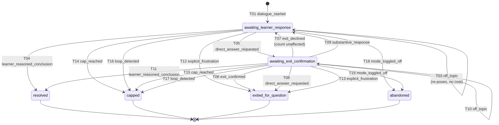

# UC-05 — Socratic Method Coaching

A standalone backend service. When a learner enables Socratic mode, a question
receives a **guiding question** that moves them toward reasoning out the answer
themselves, rather than a direct answer — and the dialogue is managed so the
learner is never trapped in it.

No frontend. No production database. No production authentication. No agent
framework, no RAG, no vector store, no autonomous loop. A request/response
service with an explicit, persisted, inspectable dialogue state machine.

Every external dependency is reached through a port that this repository
defines and mocks. The whole test suite runs offline with no API key.

## Quick start

```bash
python -m pytest -q                       # 508 tests, 0 skipped, ~4s
uvicorn uc05.api.app:app --reload         # http://127.0.0.1:8000/docs
```

```bash
# A dialogue, end to end.
curl -X PUT localhost:8000/api/v1/socratic/mode/s1 \
     -H 'X-User-Id: learner-1' -H 'Content-Type: application/json' \
     -d '{"enabled": true}'

curl -X POST localhost:8000/api/v1/socratic/questions \
     -H 'X-User-Id: learner-1' -H 'Content-Type: application/json' \
     -d '{"session_id": "s1", "question_text": "When is a contract formed?"}'
```

## Documents

| | |
|---|---|
| [`docs/SHARED_CONTRACT.md`](docs/SHARED_CONTRACT.md) | What UC-05 reads and writes, with exact types. Every field marked **specified** or **assumed**. Read this first if you own a neighbouring component. |
| [`docs/assumptions.md`](docs/assumptions.md) | Every invented field, shape, enum value and behaviour, with why, risk, and where in code. Includes two contract gaps raised rather than worked around. |
| [`docs/INTEGRATION.md`](docs/INTEGRATION.md) | Swapping a mock for a real upstream: one file, one registry line, one env var. With a fully worked example. |

## The state machine

Socratic mode is stateful, and state is **never** delegated to a generator's
memory. One state machine instance per question — a *dialogue* — persisted and
inspectable. Every rule in the specification is a transition rule, so they all
live in one declarative table:
[`uc05/domain/state_machine.py`](uc05/domain/state_machine.py).



Four transitions deliver a direct answer, and only four: T06/T08
(`exited_on_request`), T12/T13 (`exited_on_frustration`), T14/T15 (`capped`),
T16/T17 (`loop_detected`). Nothing else can, and a test asserts it over the
table rather than over a sample of behaviour.

## Project layout

```
uc05/
  domain/          the rules. no I/O, no framework.
    state_machine.py   the transition table — start here
    enums.py           closed vocabularies, each marked SPECIFIED or ASSUMED
    models.py          Dialogue, ExchangeRecord, InteractionLogRecord, ...
    vocabulary.py      acknowledgements, praise list, frustration phrases
    intent_rules.py    explicit-statement detection (not sentiment scoring)
    normalisation.py   deterministic loop detection
    profiles.py        NARIC level -> explanation profile
    errors.py          typed errors: the port contract
  ports/           protocols. every crossing of the boundary.
  adapters/
    fake/            deterministic mocks. the suite runs on these.
    memory/          lightweight local persistence.
    real/            _template.py (copy this) + ConfiguredGenerator (off by default)
    foreign/         a deliberately foreign family, shipped as swap evidence
    local/           a file-backed session-mode store, added to prove the swap
  application/
    socratic_service.py  the only orchestrator
    guards.py            rejects a generator that answers, praises or restates
    reasoning_chain.py   assembles the cap's chain from the record, never regenerated
    prompts.py           server-side versioned prompt registry
    logging_config.py    privacy allow-list — refuses learner content by construction
  api/             FastAPI routes, strict schemas, uniform error envelope
  registry.py      provider registries. adding a provider is one line.
  composition.py   the composition root. ADAPTER_MODULES lives here.
tests/
  conformance/     reusable, adapter-agnostic suites, parameterised on a harness
  test_foreign_adapter_swap.py   the swap, demonstrated rather than asserted
```

## Design decisions worth knowing

**Generate before you mutate.** Every provider call for a turn happens before
any change to the dialogue is persisted. A generator timeout cannot consume an
exchange, half-open a dialogue, or leave state a retry would trip over.

**Intents are not events.** A learner message becomes an intent; an intent
becomes an event *given the current state*. That is what makes "never exit
unilaterally" structural: a bare "yes" with no offer open is a substantive
response, and the same "yes" after an offer is a confirmation.

**Praise is caught mechanically, from both directions.** The same explicit
praise list checks our own fixed strings and every generator output. Praise from
a generator is `ProviderInvalidResponse` — rejected, not sanitised.

**Loop detection is deterministic.** Normalised token sets and a Jaccard
threshold, no model, so it is testable offline and a reviewer can verify it by
reading it. A reworded repeat is caught; a question that advances is not.

**Learner reasoning stays out of application logs.** The logger takes an
allow-list and raises on anything else, so `question_text` cannot reach a log
line by accident. Dialogue content lives in the dialogue store, which has an
owner and an ownership check on every read.

## Environment note

`structlog` is unavailable here, so logging is stdlib `logging` with a JSON
formatter — the alternative the brief permits. The privacy guarantee lives in
the allow-list, not the library.
